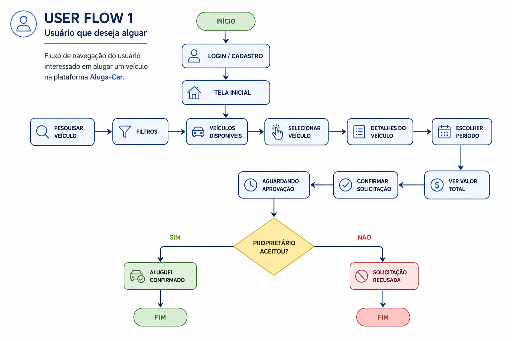
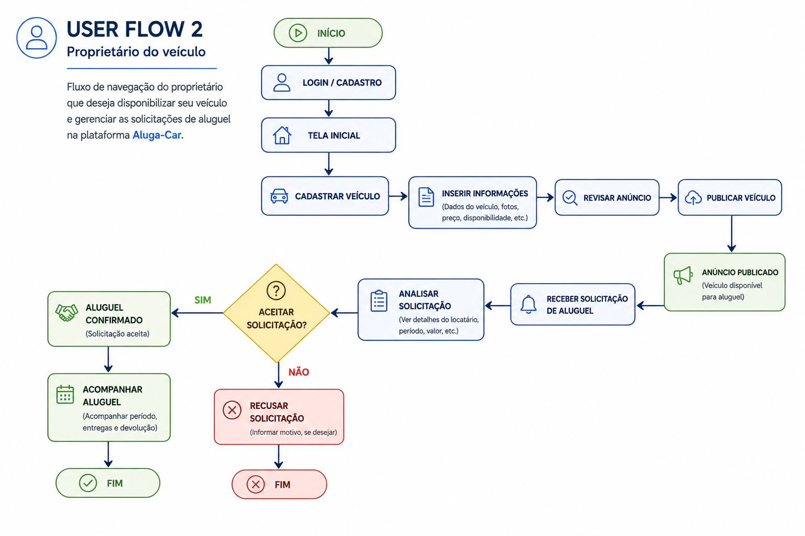
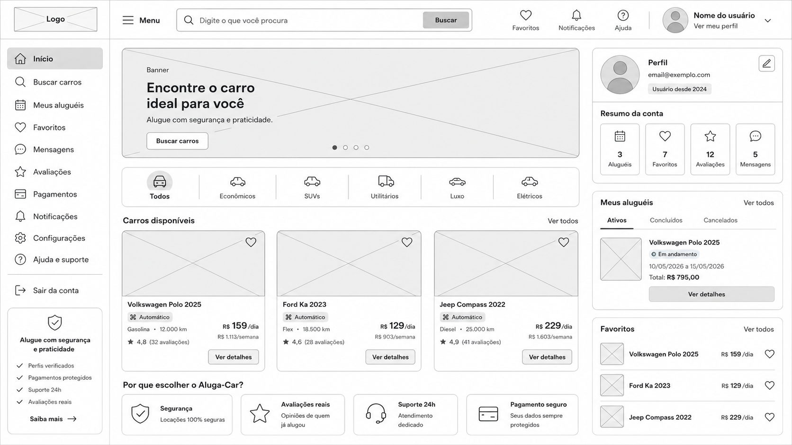

# ALUGA-CAR

## Plataforma para aluguel de veículos

### Equipe do projeto

- Gustavo Mendes Da Silva
- Jeferson Oliveira Santos
- Nathaly Nagem Araújo
- Nicolas Brian Silva Bueno Horta
- Victor De Aquino Gomes Miguel
- Vinicius Gabriel Vaz Lomba

### Professor Tutor

Joyce Christina de Paiva Carvalho

# 1. Documentação de Contexto

## 1.1 Introdução

O aluguel de veículos representa uma alternativa de mobilidade para pessoas que 
necessitam de um automóvel para uso pessoal ou profissional. Entretanto, o processo 
tradicional de locação pode apresentar dificuldades relacionadas a custos, disponibilidade e 
critérios estabelecidos pelas empresas do setor. Paralelamente, existem proprietários de 
veículos que utilizam seus automóveis de forma parcial e possuem interesse em 
disponibilizá-los para aluguel, mas encontram dificuldades para alcançar potenciais 
interessados. 
Nesse contexto, surge a oportunidade de utilizar a tecnologia para aproximar proprietários 
de veículos e pessoas interessadas em alugá-los. O presente projeto propõe o 
desenvolvimento de uma solução digital voltada à intermediação desse processo, buscando 
facilitar a conexão entre oferta e demanda, ampliar as opções disponíveis aos usuários e 
proporcionar maior organização e praticidade nas negociações de aluguel de veículos. 

## 1.2 Problema

Atualmente, pessoas que precisam alugar um veículo costumam recorrer às grandes 
locadoras, porém esse processo pode apresentar algumas dificuldades, como preços 
elevados, exigências de documentação, análise de crédito e critérios que podem limitar o 
acesso ao serviço. Além disso, nem sempre há veículos disponíveis que atendam às 
necessidades específicas do cliente, principalmente quando a necessidade é por um 
período curto, seja para uso pessoal, trabalho ou prestação de serviços por meio de 
aplicativos como Uber, 99 e plataformas de entrega. 
Ao mesmo tempo, existem proprietários particulares que possuem veículos que 
permanecem parados por determinados períodos e poderiam ser utilizados para gerar uma 
renda adicional, mas que não encontram uma forma simples, segura e organizada de 
disponibilizá-los para locação. Dessa forma, existe uma dificuldade de conexão entre 
pessoas que possuem veículos disponíveis e aquelas que precisam utilizá-los 
temporariamente. 
Diante desse cenário, identifica-se a necessidade de uma solução que facilite essa 
conexão, oferecendo uma alternativa mais acessível e prática para quem busca alugar um 
veículo e, ao mesmo tempo, proporcionando aos proprietários uma maneira segura e 
organizada de disponibilizar seus automóveis. 

## 1.3 Objetivos

O objetivo geral deste projeto é desenvolver uma proposta de aplicação web capaz de 
conectar proprietários de veículos particulares a pessoas interessadas em realizar a locação 
de um automóvel, oferecendo uma alternativa às formas tradicionais de aluguel de veículos. 
 
• Facilitar a busca e a locação de veículos, permitindo que os usuários pesquisem 
veículos disponíveis, consultem informações, valores e condições e realizem 
solicitações de aluguel.  
• Proporcionar aos proprietários uma forma organizada de disponibilizar seus 
veículos, permitindo cadastrar automóveis, definir preços e períodos de 
disponibilidade e gerenciar solicitações de locação.  
• Oferecer uma plataforma prática, acessível e segura, buscando proteger os 
dados dos usuários, organizar as informações das locações e facilitar a interação 
entre proprietários e locatários. 

## 1.4 Justificativa

A escolha deste problema está relacionada à crescente demanda por soluções de 
mobilidade mais acessíveis e flexíveis. Segundo a Associação Brasileira das Locadoras de 
Automóveis (ABLA), o setor de locação de veículos movimentou R$ 52,9 bilhões em 2024, 
apresentando crescimento de 17,8% em relação ao ano anterior. Além disso, 46% da frota 
destinada a clientes foi utilizada em locações de curta duração, principalmente para turismo 
e motoristas de aplicativos. 
Diante desse cenário, o projeto propõe uma plataforma que conecte proprietários 
particulares interessados em obter uma renda adicional com seus veículos a pessoas que 
precisam de um automóvel por alguns dias ou semanas. A solução busca tornar o processo 
de busca e locação mais simples, acessível, organizado e seguro para ambas as partes. 

## 1.5 Público-alvo

O público-alvo do projeto é composto por dois grupos principais: proprietários de veículos, 
homens e mulheres adultos, interessados em obter uma renda adicional por meio da 
locação de seus automóveis; e pessoas maiores de 18 anos que necessitam de um veículo 
por determinado período, seja para uso pessoal, viagens, trabalho ou atividades realizadas 
por meio de aplicativos de transporte e entregas. 
A plataforma será direcionada principalmente a pessoas que buscam uma alternativa de 
locação mais acessível, prática e flexível, facilitando a conexão entre proprietários e 
interessados em alugar veículos.

# 2. Especificação do Projeto

## 2.1 Perfis de Usuários

### Perfil 1 – Proprietário do veículo

**Descrição:**  
Pessoa que possui um veículo e deseja disponibilizá-lo para locação por meio da plataforma. Pode cadastrar informações do veículo, definir valores e períodos disponíveis e acompanhar as solicitações de aluguel.

**Necessidades:**  
Cadastrar e gerenciar veículos; informar disponibilidade e valores; receber e analisar solicitações; acompanhar locações; consultar informações dos usuários; ter segurança e transparência durante as negociações.

### Perfil 2 – Locatário

**Descrição:**  
Pessoa que necessita de um veículo por determinado período e utiliza a plataforma para pesquisar, comparar e solicitar a locação de veículos disponíveis. Pode utilizar o veículo para necessidades pessoais, profissionais ou trabalho com aplicativos.

**Necessidades:**  
Pesquisar veículos disponíveis; visualizar informações, valores e condições; comparar opções; realizar solicitações de locação; acompanhar reservas; ter acesso a informações claras sobre o veículo e as condições do aluguel.

### Perfil 3 – Administrador do sistema

**Descrição:**  
Responsável pelo gerenciamento e acompanhamento da plataforma. Possui acesso às informações necessárias para administrar usuários, veículos, anúncios e locações, garantindo o funcionamento adequado do sistema.

**Necessidades:**  
Gerenciar usuários e veículos cadastrados; acompanhar locações; verificar informações e ocorrências; administrar conteúdo da plataforma; identificar problemas e garantir o funcionamento e a segurança do sistema.

## 2.2 Histórias de Usuários

Proprietário do veículo 
 
Cadastrar meu veículo na plataforma, 
informando suas características, valor 
e disponibilidade. 
 
Disponibilizá-lo para 
locação de forma 
organizada. 
 
Proprietário do veículo 
 
Visualizar e gerenciar as solicitações 
de locação recebidas. 
 
Decidir quais 
solicitações desejo 
aceitar. 

 
Locatário 
 
 
Criar uma conta e informar meus dados 
na plataforma. 
 
 
Poder utilizar os recursos de 
pesquisa e locação de veículos. 
 
 
Locatário 
 
 
Pesquisar veículos disponíveis e 
visualizar suas informações, valores e 
condições. 
 
Encontrar uma opção adequada 
às minhas necessidades e ao meu 
orçamento. Decidir quais 
solicitações desejo aceitar. 
 
 
Locatário 
 
 
Solicitar a locação de um 
veículo para um período 
específico. 
 
 
 
Ter acesso a um veículo durante o 
período necessário. 
 
 
Locatário 
 
Acompanhar o status da minha 
solicitação de locação. 
 
Saber se a solicitação foi aceita e 
consultar as informações da 
reserva. 
 
 
Administrador 
 
 
 
Gerenciar os usuários e veículos 
cadastrados na plataforma. 
 
   Manter os dados organizados e 
garantir o funcionamento adequado do 
sistema. Poder utilizar os recursos de 
pesquisa e locação de veículos. Criar 
uma conta e informar meus dados na 
plataforma. 
 
   
  
Administrador 
 
 
 
Acompanhar as locações 
realizadas pela plataforma. 
   
 
 Auxiliar no controle das operações e 
na identificação de possíveis 
problemas.

## 2.3 Requisitos do Projeto

### 2.3.1 Requisitos Funcionais

RF01 
 
O sistema deverá permitir que o proprietário cadastre um veículo 
na plataforma. 
 
Alta 
 
RF02 
 
O sistema deverá permitir que o proprietário informe as 
características do veículo cadastrado. 
 
Alta 
 
RF03 
 
O sistema deverá permitir que o proprietário informe o valor da 
locação do veículo. 
 
Alta 
 
RF04 
 
O sistema deverá permitir que o proprietário informe os períodos 
de disponibilidade do veículo. 
 
Alta 
 
RF05 
 
O sistema deverá permitir que o proprietário visualize as 
solicitações de locação recebidas. 
 
Alta 
 
RF06 
 
O sistema deverá permitir que o proprietário aceite ou recuse uma 
solicitação de locação. 
 
Alta 
   
 
RF07 
 
O sistema deverá permitir que o locatário crie uma conta na 
plataforma. 
 
Alta 
 
RF08 
 
O sistema deverá permitir que o locatário pesquise veículos 
disponíveis para locação. 
 
Alta 
 
RF09 
 
O sistema deverá permitir que o locatário consulte as informações 
dos veículos disponíveis. 
 
Alta 
 
RF10 
 
O sistema deverá permitir que o locatário solicite a locação de um 
veículo. 
 
Alta 
 
RF11 
 
O sistema deverá permitir que o locatário informe o período 
desejado para a locação. 
 
Alta 
 
RF12 
 
O sistema deverá permitir que o locatário acompanhe o status de 
sua solicitação. 
 
Média 
 
RF13 
 
O sistema deverá permitir que o administrador gerencie os 
usuários cadastrados. 
 
Média 
 
RF14 
 
O sistema deverá permitir que o administrador gerencie os 
veículos cadastrados. 
 
Média 
 
RF15 
 
O sistema deverá permitir que o administrador acompanhe as 
locações realizadas na plataforma. 
 
Média

### 2.3.2 Requisitos Não Funcionais

RNF01 
O sistema deverá possuir uma interface acessível para 
pessoas com dificuldades de visualização, utilizando textos 
legíveis, contraste adequado entre cores, possibilidade de 
ampliação do conteúdo e elementos visuais de fácil 
identificação.  
 
 
Alta 
 
RNF02 
 
O sistema deverá proteger os dados dos usuários contra 
acessos não autorizados. 
 
Alta 
 
RNF03 
 
O sistema deverá responder às principais operações em até 3 
segundos, considerando condições normais de utilização. 
 
Média 
 
RNF04 
 
O sistema deverá possuir disponibilidade mínima de 98% ao 
mês, exceto durante períodos previamente programados de 
manutenção. 
 
Média 
 
RNF05 
 
O sistema deverá ser compatível com computadores e 
dispositivos móveis. 
 
Alta 
 
RNF06 
 
O sistema deverá manter os dados cadastrados de forma 
íntegra e consistente. 
 
Alta

# 3. Referências Bibliográficas

ASSOCIAÇÃO BRASILEIRA DAS LOCADORAS DE AUTOMÓVEIS (ABLA). Setor de 
locação de veículos seguiu em crescimento durante o último ano. 2025. Disponível em: 
https://www.abla.com.br/noticia/setor-de-locacao-de-veiculos-seguiu-em-crescimento
durante-o-ultimo-ano--. Acesso em: 20 ago. 2026.

## 3. Metodologia

### 3.1 Divisão de papéis

Victor De Aquino Gomes Miguel: documentação e levantamento de requisitos.

Gustavo Mendes Da Silva - Jeferson Oliveira Santos: desenvolvimento da interface e protótipo.

Nathaly Nagem Araújo - Nicolas Brian Silva Bueno Horta: elaboração dos User Flows e organização do GitHub.

Vinicius Gabriel Vaz Lomba: revisão da documentação e testes.

### 3.2 Processo

O desenvolvimento do projeto Aluga-Car será realizado de forma colaborativa, dividido em etapas. Inicialmente, a equipe realizará o levantamento e a análise do problema e dos requisitos. Em seguida, serão elaborados os fluxos de navegação e o protótipo da solução. Após a definição da interface, a equipe realizará a implementação e os testes da aplicação. Durante o desenvolvimento, serão realizadas reuniões para acompanhar o progresso, identificar problemas e revisar as atividades realizadas.

Simplificando:

Levantamento → Requisitos → User Flow → Protótipo → Desenvolvimento → Testes → Revisão

### 3.3 Ferramentas

GitHub: armazenamento do projeto, controle de versões e documentação.
Canva: criação de apresentações, diagramas e materiais visuais.
Figma: elaboração dos protótipos e interfaces.
Visual Studio Code: desenvolvimento e edição dos códigos.
Microsoft Teams: comunicação e reuniões da equipe.

## 4. Projeto de Interface

### 4.1 User Flow

O User Flow apresenta o fluxo de navegação dos usuários dentro da solução Aluga-Car, demonstrando as principais etapas realizadas para a utilização da plataforma.

#### Fluxo do usuário que deseja alugar

#### Fluxo do proprietário do veículo

## Wireframe

A seguir é apresentado o wireframe da interface principal do sistema Aluga-Car, demonstrando a organização dos principais elementos e funcionalidades da plataforma.

